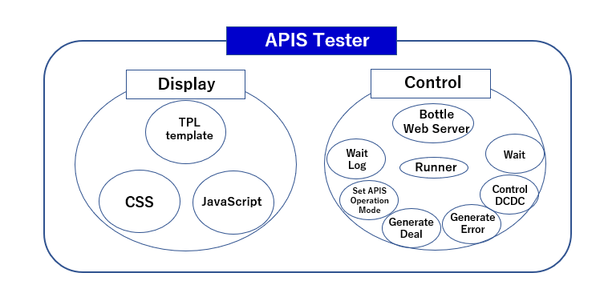
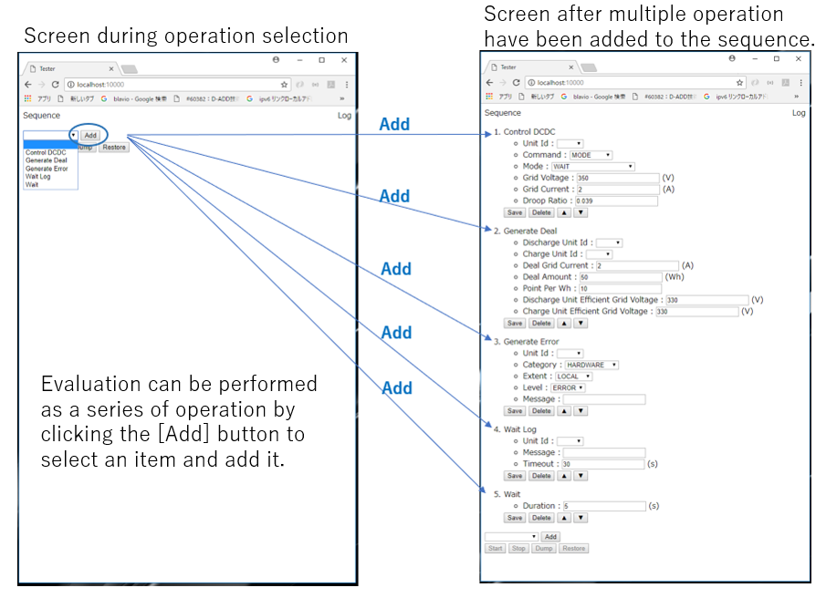
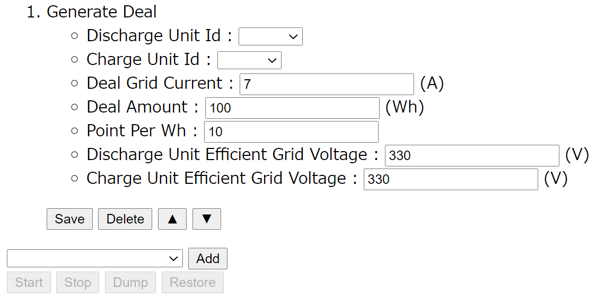
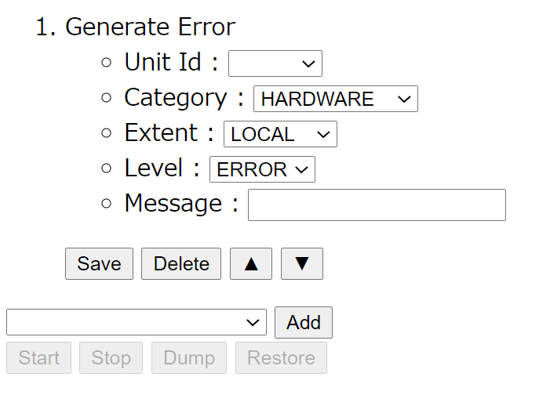
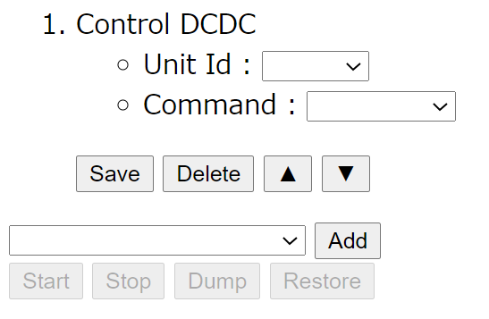
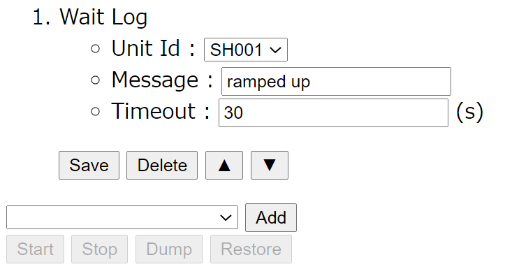

**apis-tester Specification**
=====
**Rev 0.62**

# **Contents**
- [**apis-tester Specification**](#apis-tester-specification)
- [**Contents**](#contents)
- [**1. Terms and Abbreviations**](#1-terms-and-abbreviations)
- [**2. Overview**](#2-overview)
- [**3. Software Composition**](#3-software-composition)
  - [**3.1.** **Software Architecture**](#31-software-architecture)
  - [**3.2. Software Connection Configuration**](#32-software-connection-configuration)
- [**4. Detailed Description of Actions**](#4-detailed-description-of-actions)
- [**4. Configuration files**](#4-configuration-files)
  - [**4.1. config.py**](#41-configpy)
  - [**4.2. conf/logger.conf**](#42-confloggerconf)
- [**5. Wait Log Keywords**](#5-wait-log-keywords)
- [**6. Logging Functions**](#6-logging-functions)
  - [**6.1. Log Level**](#61-log-level)
  - [**6.2. Log Output Destinations**](#62-log-output-destinations)
- [**7. Error Handling**](#7-error-handling)
- [**8. Security**](#8-security)
  - [**8.1. Security of Communication between User and APIS Tester**](#81-security-of-communication-between-user-and-apis-tester)
  - [**8.2. Security of Communication between apis-web and APIS Tester**](#82-security-of-communication-between-apis-web-and-apis-tester)
  - [**8.3. Security of Communication between Device Driver and APIS Tester APIS**](#83-security-of-communication-between-device-driver-and-apis-tester-apis)
- [**9. Privacy**](#9-privacy)
- [**10. OPEN-SOURCE Software Licenses**](#10-open-source-software-licenses)
- [**11. Operating Environment**](#11-operating-environment)
- [**12. Starting APIS Tester**](#12-starting-apis-tester)

 

# **1. Terms and Abbreviations**

| **Term**      | **Explanation**|
| ------------- | ----------------------------------------------------------------------------------------------------------------------------------------------------------------------------------------------------------------------------------------------------------------------------------------------------------------------------------------------------------------------------------------------------------------------------------------------------------------------------------------------- |
| apis-main     | Software for energy sharing developed by Sony CSL that enables autonomous decentralized control. (For more information, refer to the apis-main specification document.)                                                                                                                                                                                                                                                                                                                         |
| apis-web      | Software for providing Main Controller with information that is specific to each node on which apis-main is installed and information related to energy sharing between nodes. (For more information, refer to the apis-web Specification Document.)                                                                                                                                                                                                                                            |
| Budo Emulator | An apis-web service that provides Main Controller with information on energy sharing between apis-main and can be used to change settings such as energy sharing start/stop for all apis-main nodes or individual nodes. The ‘Emulator’ in the name is a reference to ‘Budo’, which is software for automatic energy sharing that features centralized management control and was used before the development of apis-main. Budo Emulator simulates the information provision function of Budo. |
| API Server    | An apis-web service that can generate any energy sharing execution command or any error processing command within a cluster.                                                                                                                        |
| Grid Master   | Name of a service included in apis-main. Controls the DC Grid for energy sharing.                                                                                                                                                                   |

 

# **2. Overview**

APIS Tester is a tool for testing and evaluation of APIS. It can be used to evaluate energy sharing and to schedule automatic execution of error processing evaluation and log the evaluation results. APIS Tester uses apis-web, which is connected by a communication line such as Ethernet, and the Web API provided by DC/DC converter device drivers to perform the operations needed for evaluation (Figure 2-1).

  
図2-1

 

# **3. Software Composition**

## **3.1.** **Software Architecture**

The APIS Tester software architecture is broadly divided into a display part and a control part (Figure 3-1). The display part has a standard composition and the Web content is structured with TPL templates, styled with CSS, and made dynamic with JavaScript. The control part uses the Python Bottle Web app framework and Runner creates six threads according to the order of scheduled evaluations. The threads are Set APIS Operation Deal, Generate Deal, Generate Error, Control DCDC, Wait Log, and Wait. (Only the Wait Log thread is run in parallel; the others are run sequentially.)

  
図3-1  

 

## **3.2. Software Connection Configuration**

The connection diagram for the APIS Tester software is illustrated in Figure 3-2. When the user accesses APIS Tester from a browser via the Web API, the Bottle server receives the request and downloads the TPL template, CSS, and JavaScript of the display part to the browser and the page is displayed. The user uses the displayed page to register and execute the operations required for APIS evaluation. The Bottle server receives the commands issued by the user and invokes Runner to create threads for setting the APIS operation mode and other registered operations in sequence. The threads call the Web API supplied by apis-web and the DC/DC converters according to their respective functions.

図3-2  

 

# **4. Detailed Description of Actions**

The APIS Tester start-up screen is simple, having just a pull-down menu and a few buttons (Figure 4-1). The pull-down menu is used to select an operation, such as Set APIS Operation Mode or Generate Deal, and the selected operation can be added to the APIS Tester Sequence screen by clicking the \[Add\] button. Operations added to the sequence screen are assigned numbers in order of their selection. When the \[Start\] button is clicked, the operations are executed consecutively in order of their number, from lowest to highest.

  
Figure 4-1

  
Figure 4-2

1)  Set the APIS Operation Mode  
  * APIS has four modes for energy sharing within a cluster. Modes that apply to the entire cluster are called the Global Operation Modes and modes that apply to a single node are called Local Operation Modes. “Set APIS Operation Mode” is the operation for changing modes. Of the four modes described below, only ‘Soft’, ‘Stop’, and ‘Force Stop’ are available as local operation modes.
    * Run: Energy sharing enabled; this is the standard setting during energy sharing.
    * Soft Stop: Current energy sharing continues, but no new energy sharing is generated.
    * Force Stop: Current energy sharing stop and no new energy sharing is generated.
    * Manual: DC/DC converters and other such equipment are operated manually for inspection, etc.

  
Figure 4-3  

  
Figure 4-4  

The APIS Tester pull-down menu of Figure 4-1 is used to select Set APIS Operation Mode and the \[Add\] button is clicked to add the screen shown in Figure 4-3.  
  
Select the desired Unit Id and Global Operation Mode from the pull-down menu next to the respective items. (The Unit Id items that appear in the pull-down menu are set in config.py. See section 4.1, “config.py”.)  
  
Setting Unit Id to blank enables setting of the Global Operation Mode; if a Unit Id is set, it is possible to set the Local Operation Mode, which affects only the unit specified by the Unit Id. Then, clicking on the \[Save\] button enables the grayed-out \[Start\], \[Dump\], and \[Restore\] button operations. When an operation is executed, a Web API call is issued to the apis-web Budo Emulator.  
(For information on apis-web and Budo Emulator, refer to the apis-web Specification Document.)

2)  Generate Deal  
  * Generate Deal is an operation for intentionally generating energy sharing run command in a cluster. Select Generate Deal from the APIS Tester pull-down menu (Figure 4-1) and then click the \[Add\] button to add the screen of Figure 4-5. Before saving the Generate Deal operation, the following items must be entered.
    * Discharge Unit Id: Specify the discharge-side node with Unit Id.
    * Charge Unit Id: Specify the charge-side node with Unit Id.
    * Deal Grid Current: Specify the current for energy sharing \[A\].
    * Deal Amount: Specify the amount of power for energy sharing \[Wh\].
    * Point Per Wh: Specify the number of points per watt-hour for energy sharing.
    * Discharge Unit Efficient Grid Voltage: Specify the DC Grid voltage, taking the efficiency of the DC/DC converter of the discharge-side node into account.
    * Charge Unit Efficient Grid Voltage: Specify the DC Grid voltage, taking the efficiency of the DC/DC converter of the charge-side node into account.  
       
         A screen that reflects the default values can be added by clicking on the \[Add\] button with the default values in config.py set for items other than Discharge Unit Id and Charge Unit Id. The Unit Ids that appear in the pull-down menus for Discharge Unit Id and Charge Unit Id are based on the settings in config.py. (For information on config.py, see section 4.1.)

  
Figure 4-5
  
Then, clicking on the \[Save\] button enables the grayed-out \[Start\], \[Dump\], and \[Restore\] button operations. When an appropriate operation is executed, a Web API call is issued to the apis-web API server.  
(For information on apis-web and the API server, refer to the apis-web Specification Document.)

3)  Generate Error  
  * The Generate Error operation is for generating an arbitrary error processing command in a cluster. Select Generate Error from the APIS Tester pull-down menu (Figure 4-1) and then click the \[Add\] button to add the screen of Figure 4-6. Before saving the Generate Error operation, the following items must be entered.
    * Unit Id: Specify the node for which to generate the error with a Unit Id.
    * Category: Select an Error Category (HARDWARE, FRAMEWORK, LOGIC, or USER). (For more information, refer to apis-main Specifications Document.)
    * Extent: The error scope of influence is set to “GLOBAL” or “LOCAL”. (For more information, refer to apis-main Specifications Document.)
    * Level: The error level is set to “FATAL”, “ERROR”, or “WARN”. (For more information, refer to apis-main Specifications Document.)
    * Message: Enter a message to be put into the log. (Optional)  
     
     A screen that reflects the default values can be added by clicking on the \[Add\] button with the default values in config.py set for items other than Unit Id and Message. The Unit Ids that appear in the pull-down menus for Discharge Unit Id and Charge Unit Id are based on the settings in config.py. (For information on config.py, see section 4.1.)

  
Figure 4-6

Then, clicking on the \[Save\] button after setting the appropriate items enables the grayed-out \[Start\], \[Dump\], and \[Restore\] button operations. When an appropriate operation is executed, a Web API call is issued to the apis-web API server.

4)  Control DCDC  
  * The Control DCDC operation is for controlling the DC/DC converters in a cluster.
 
> **\[Caution\] Because of conflict with the instructions of the DC/DC converter device drivers, be sure to either set apis-main to manual mode or shut it down when it is necessary to use this operation.**  

Select Control DCDC from the APIS Tester pull-down menu (Figure 4-1) and then click the \[Add\] button to add the screen of Figure 4-7. Before saving the Generate Error operation, the following items must be entered. Depending on the command that is selected, the setting screen may switch as shown in Figure 4-8 to Figure 4-12.

 * Unit Id: Specify the DC/DC converter node to be controlled by Unit Id.
 * Command: Specify the DC/DC converter command (MODE, VOLTAGE, or CURRENT).  
  

  
Figure 4-7

(1)  When MODE is selected  
This operation is for changing the operation mode of the DC/DC converter. The screen switches to the one shown in Figure 4-8 and the items listed below are added for setting.

  
Figure 4-8

(1-1)Mode  
&emsp;Enter the mode setting for the DC/DC Converter.  

(1-1-1)VOLTAGE REFERENCE  
&emsp;Set to Constant Voltage Mode (CV Mode).  
&emsp;Set the DC Grid target voltage to Grid Voltage.  
&emsp;Set the limit of the current output to the DC Grid to Grid Current.  
&emsp;Set the droop control to Droop Ratio.  

(1-1-2)CHARGE  
&emsp;Set to Constant Current Mode (CC Mode).  
&emsp;Set the charging current from DC Grid to Grid Current.

(1-1-3)DISCHARGE  
&emsp;Set to Constant Current Mode (CC Mode).  
&emsp;Set the discharging current from DC Grid to Grid Current.  

(1-1-4)WAIT  
&emsp;Set to Wait Mode.

  
(1-2) Grid Voltage  
When VOLTAGE\_REFERENCE has been set as the mode, the DC Grid target voltage is set to this value.  
  
(1-3) Grid Current  
When the mode setting is VOLTAGE\_REFERENCE, the current output to the DC Grid is limited by this value.  
When the mode setting is CHARGE or DISCHARGE, the charging or discharging current to the DC Grid is set to this value.  
  
(1-4) Droop Ratio  
When the mode setting is VOLTAGE\_REFERENCE, droop is controlled by this value.  
  
  

(2)  When VOLTAGE is selected  
The screen switches to the one shown in Figure 4-9 and the items listed below are added for setting.  
This operation is for changing the target voltage on the DC Grid side when the DC/DC converter of the node specified by Unit Id is operating in VOLTAGE\_REFERENCE mode.  
  
Figure 4-9  

(2-1) Grid Voltage  
&emsp;Change the DC Grid target voltage to the set value.  
(2-2) Droop Ratio  
&emsp;Change the droop control to the set value.

  

(3)  When CURRENT is selected  
The screen switches to the one shown in Figure 4-10 and the items listed below are added for setting.  
This operation is for changing the target voltage on the DC Grid side when the DC/DC converter of the node specified by Unit Id is operating in CHARGE, DISCHARGE, or VOLTAGE\_REFERENCE mode.  
  
Figure 4-10  

(3-1) Grid Current
&emsp;Change the DC Grid current to the set value.  
  
Then, clicking on the \[Save\] button enables the grayed-out \[Start\], \[Dump\], and \[Restore\] button operations. When an operation is executed, a call is issued to the Web API of the DC/DC converter device driver.  

(5)  Wait Log  
This operation pauses the operation schedule and does not proceed to the next scheduled operation until a specified keyword is detected in the apis-main log output to the communication line by UDP. Because that log includes the apis-main operation log, etc., the wait log operation can be used to halt the execution of one operation until another operation has been executed.  
   
Select Wait Log from the APIS Tester pull-down menu (Figure 4-1) and then click the \[Add\] button to add the screen shown in Figure 4-11. Before saving the Wait Log operation and adding it to the scheduling sequence, the following items must be entered.  

* Unit Id: Specifies the Unit Id of the node to monitor for the keyword. If Unit Id is not specified, all nodes are monitored.
* Message: Specifies the keyword to monitor for. Regular expressions are supported.(Example keywords are given below.)
* Timeout: Specifies the timeout time.  
 

  
Figure 4-11

Then, clicking on the \[Save\] button after setting the appropriate items enables the grayed-out \[Start\], \[Dump\], and \[Restore\] button operations.  

  

6)  Wait  
This operation pauses the operation schedule and does not proceed to the next scheduled operation until a specified amount of time has passed.    
  Select Wait from the APIS Tester pull-down menu (Figure 4-1) and then click the \[Add\] button to add the screen shown in Figure 4-12. Before saving the Wait operation and adding it to the scheduling sequence, the following items must be entered.  
* Duration: Specifies the amount of time to wait in seconds.

  
Figure 4-12

Then, clicking on the \[Save\] button after setting the appropriate items enables the grayed-out \[Start\], \[Dump\], and \[Restore\] button operations.  

  

\[Other operations\]  
　After the \[Save\] operation is performed, the buttons change as shown in Figure 4-13.

* \[Save\] button: Sets the edited items.
* \[Edit\] button: Returns to item editing.
* \[Delete\] button: Deletes the operation from the operation sequence.
* \[▲\]\[▼\] button: Changes the order of the operation added to the sequence.
* \[Start\] button: Executes the saved operations.
* \[Stop\] button: Stops the execution of the operation sequence in progress.
* \[Dump\] button: Outputs the operation and the entered setting values to a text file in JSON format.
* \[Restore\] button: Reads the saved JSON text files and reconstructs the original operation sequence.

  

\[APIS Tester Operation LogOutput\]  
The log for execution of the operation sequence is displayed on the APIS Tester browser (Figure 4-14). The log display can be cleared by clicking the \[Erase\] button.

  
Figure 4-13

 

# **4. Configuration files**
    
## **4.1. config.py**

The APIS Tester configuration settings are described below.
|||
| -------------------------------------- | ------------------------------------------------------------------------------------------------------------------------------------------------------------------ |
| my\_host                               | The Bottle Web server IP address                                                                                                                                   |
| my\_port                               | The Bottle Web server port number                                                                                                                                  |
| is\_emulation                          | This is set to True or False to specify whether actual DC/DC Converters and batteries are to be used (False) or hardware emulation is to be used (True).           |
| emulator\_host                         | The hardware emulator IP address                                                                                                                                   |
| emulator\_port                         | The hardware emulator port number                                                                                                                                  |
| apis\_web\_host                        | The apis-web IP address                                                                                                                                            |
| apis-web\_budo\_emulator\_port         | The apis-web budo\_emulator port number                                                                                                                            |
| apis-web\_api\_server\_port            | The apis-web api\_server port number                                                                                                                               |
| apis\_log\_group\_address              | An address for multicasting to a group of particular IP addresses; it is the same as the log.Receiver.multicatGroupAddress in the apis-log config.json file.       |
| apis\_log\_port                        | The apis-log Log Receiver port number                                                                                                                              |
| units.id                               | This specifies the Unit Id of the node to be evaluated by APIS Tester. A Unit Id can be selected from the Unit Id pull-down menu.                                  |
| units.name                             | Sets the Unit Id of the node to be evaluated by APIS Tester. It is used for displaying logs, etc.                                                                  |
| units.host                             | The IP address for the node to be evaluated by APIS Tester.                                                                                                        |
| units.dcdc\_port                       | The port number for the DC/DC converter data of the node to be evaluated by APIS Tester.                                                                           |
| units.emu\_port                        | The port number for the DC/DC converter device driver for obtaining battery data of the node to be evaluated by APIS Tester.                                       |
| default\_control\_dcdc\_command        | Sets the default value to be displayed in the Command field for the Control DCDC operation.                                                                        |
| default\_control\_dcdc\_mode           | Sets the default value to be displayed in the Mode field for the Control DCDC operation.                                                                           |
| default\_grid\_voltage\_v              | Sets the default value to be displayed in the Grid Voltage field for the Control DCDC operation.                                                                   |
| default\_grid\_current\_a              | Sets the default value to be displayed in the Grid Current field for Control DCDC operation.                                                                       |
| default\_droop\_ratio                  | Sets the default value to be displayed in the Droop Ratio field for the Control DCDC operation.                                                                    |
| default\_deal\_grid\_current\_a        | Sets the default value to be displayed in the Deal Grid Current field for the Generate Deal operation.                                                             |
| default\_deal\_amount\_wh              | Sets the default value to be displayed in the Deal Amount field for the Generate Deal operation.                                                                   |
| default\_point\_per\_wh                | Sets the default value to be displayed in the Points Per Wh field for the Generate Deal operation.                                                                 |
| default\_efficient\_grid\_voltage\_v   | Sets the default value to be displayed in the Discharge Unit Efficient Grid Voltage and Charge Unit Efficient Grid Voltage fields for the Generate Deal operation. |
| default\_error\_level                  | Sets the default value to be displayed in the Level field for the Generate Error operation.                                                                        |
| default\_error\_extent                 | Sets the default value to be displayed in the Extent field for the Generate Error operation.                                                                       |
| default\_error\_category               | Sets the default value to be displayed in the Category field for the Generate Error operation.                                                                     |
| default\_wait\_log\_timeout\_s         | Sets the default value to be displayed in the Timeout field for the Wait Log operation.                                                                            |
| default\_wait\_duration\_s             | Sets the default value to be displayed in the Duration field for the Wait operation.                                                                               |
| default\_apis\_global\_operation\_mode | Sets the default value to be displayed in the Global Operation Mode field for the APIS Operation Mode operation.                                                   |
| default\_apis\_local\_operation\_mode  | Sets the default value to be displayed in the Local Operation Mode field for the APIS Operation Mode operation.                                                    |

 

## **4.2. conf/logger.conf**

APIS Tester uses logging.config.fileConfig() as the Logger initialization function. This function initializes Logger by reading the settings that are pre-defined in the logger.conf file at start-up.

<table>
<tbody>
<tr class="even">
<td>loggers</td>
<td>keys: The names of the Logger instances</td>
</tr>
<tr class="odd">
<td>handlers</td>
<td>keys: The names of the Handler instances</td>
</tr>
<tr class="even">
<td>formatters</td>
<td>keys: The names of the Formatter instances</td>
</tr>
<tr class="odd">
<td>logger_root</td>
<td>
level: Specifies the level of message output

handlers: Specifies the names of the applicable Handler instances
</td>
</tr>
<tr class="even">
<td>
handler_consoleHandler

handler_infoFileHandler
</td>
<td>
class: Defines the Handler class　

-StreamHandler: Outputs the specified stream

-FileHandler: Outputs the specified file

level: Messages of the specified level or higher are output

formatter: Specifies the name of the Formatter to use for message output

args: Arguments for the Handler

　　 Sets the log output and folder for saving log files
</td>
</tr>
<tr class="odd">
<td>
formatter_consoleFormatter

formatter_infoFileFormatter
</td>
<td>
format:　Specifies various formats

datefmt: Specifies the date format
</td>
</tr>
</tbody>
</table>

 

# **5. Wait Log Keywords**

Examples of keywords that are used when monitoring with Wait Log are listed below.

<table>
<tbody>
<tr class="odd">
<td>Checking the Grid Master Unit Id</td>
<td>gridMasterUnitId</td>
</tr>
<tr class="even">
<td>Deal information</td>
<td>deals</td>
<tr class="odd">
<td>Start Grid Master Deal processing</td>
<td>AbstractDealExecution</td>
</tr>
<tr class="even">
<td>Deal ID</td>
<td>dealIds</td>
<tr class="odd">
<td>DC grid voltage ramp-up</td>
<td>VOLTAGE\_REFERENCE.execute()</td>
</tr>
<tr class="even">
<td>DC grid voltage ramp-up completed</td>
<td>ramped up</td>
<tr class="odd">
<td>Start voltage reference authorization</td>
<td>VoltageReferenceAuthorization.execute()</td>
</tr>
<tr class="even">
<td>Voltage reference authorization successful</td>
<td>VoltageReferenceAuthorization.execute(); res.succeeded()</td>
<tr class="odd">
<td>Start current compensation</td>
<td>DealCompensation] start</td>
</tr>
<tr class="even">
<td>Start discharge</td>
<td>DcdcControllingCommand\] DISCHARGE.execute()</td>
<tr class="odd">
<td>Current compensation successful</td>
<td>compensated</td>
</tr>
<tr class="even">
<td>Energy sharing deal started</td>
<td>mediator.util.DealUtil\] deal started</td>
<tr class="odd">
<td>Energy sharing deal in progress</td>
<td>mediator.util.DealUtil\] deal cumulated</td>
</tr>
<tr class="even">
<td>Energy sharing deal stopped</td>
<td>mediator.util.DealUtil\] deal stopped</td>
</tbody>
</table>

 

# **6. Logging Functions**
    
## **6.1. Log Level**

The Python standard library “logging” module is used for log output. The settings for log output destination, log file storage location, and the log levels for output or saving are specified in the conf/logger.conf file.

 

## **6.2. Log Output Destinations**

Logs related to execution of APIS Tester operations are output to the APIS Tester browser screen. Logs for execution of JavaScript on the browser and the Web API provided by the Bottle Web server are output to the console and to a file.

 

# **7. Error Handling**

The log is output to console and to file when a problem occurs, but there is no function to reset or stop itself.

 

# **8. Security**
    
## **8.1. Security of Communication between User and APIS Tester**

There is no security in the communication between the user and APIS Tester, so IP address restriction is implemented in the Bottle Web server configuration as needed.

 

## **8.2. Security of Communication between apis-web and APIS Tester**

There is no security in the communication between the user and APIS Tester, so IP address restriction is implemented in the apis-web Web server configuration as needed.

 

## **8.3. Security of Communication between Device Driver and APIS Tester APIS**

There is no security in the communication between APIS Tester and device drivers, so IP address restriction is implemented in the device driver Web server configuration as needed.

 

# **9. Privacy**

It is necessary to check whether or not the information that can be obtained via the Web API is personal information, because what is considered to be personal information varies with the region in which APIS Tester is introduced. Caution is required, because the act of sending personal information to an external server without the permission of the information owner may be subject to personal information protection regulations such as GDPR.

 

# **10. OPEN-SOURCE Software Licenses**

The software used by APIS Tester and the relevant open-source software licensing information are listed in the table below

■ Open-source software licensing of software used by APIS Tester

| Software | Version | License           | Code Change |
| -------- | ------- | ----------------- | ----------- |
| Python   | 3.7.5   | PSL License       | None        |
| tornado  | 6.0.3   | Apache License2.0 | None        |
| Bottle   | 0.12.17 | MIT License       | None        |
| pytz     | 2019.3  | MIT License       | None        |
| six      | 1.13.0  | MIT License       | None        |
| jQuery   | 3.3.1   | MIT License       | None        |

\*Software versions may change for various reasons.

 

# **11. Operating Environment**

Operation on the computing environment described below has be confirmed.

<table>
<tbody>
<tr class="odd">
<td rowspan="3">MacBook Pro</td>
<td>CPU</td>
<td>Intel Core i5 Dual Core 3.1GHz</td>
</tr>
<tr class="even">
<td>System Memory</td>
<td>8GB</td>
</tr>
<tr class="odd">
<td>OS</td>
<td>Mac OS X 10.13.6</td>
</tr>
</tbody>
</table>

 

# **12. Starting APIS Tester**

APIS Tester is started up as described below.

1.  From the console, execute ./startTester.py.
2.  In the Web browser, enter the IP address and port number specified by the items my\_host and my\_port in config.py (E.g.: localhost:10000/) and go to that address.
